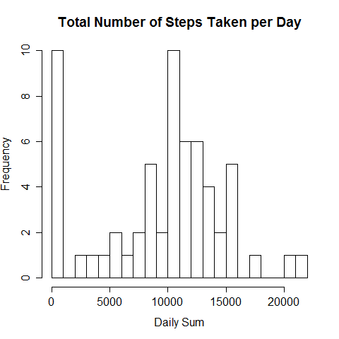
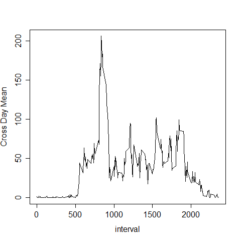
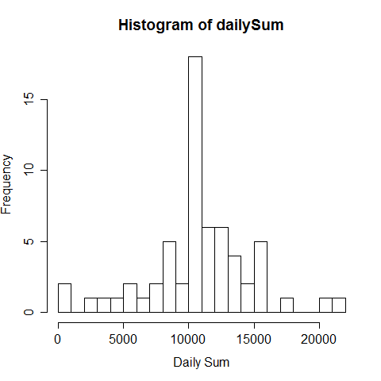
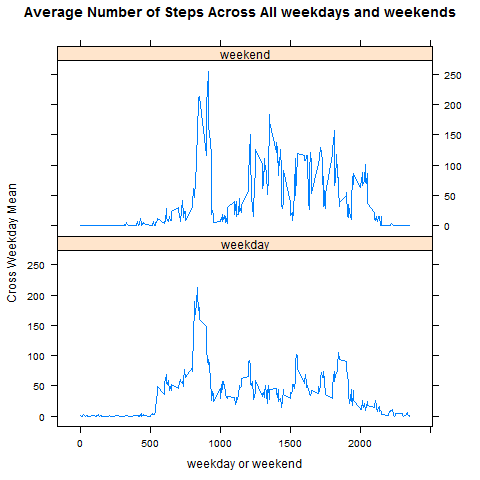

# Project #1 for Reproducible Research 

## Loading the data
```r
data1  <- read.csv("activity.csv",na.string="NA")
```

## Mean total number of steps taken per day
```r
### The total number of steps taken per day
dailySum <- tapply(data1$steps,data1$date,sum,na.rm=TRUE)
```

```
##2012-10-01 2012-10-02 2012-10-03 2012-10-04 2012-10-05 2012-10-06 2012-10-07 
##         0        126      11352      12116      13294      15420      11015 
##2012-10-08 2012-10-09 2012-10-10 2012-10-11 2012-10-12 2012-10-13 2012-10-14 
##         0      12811       9900      10304      17382      12426      15098 
##2012-10-15 2012-10-16 2012-10-17 2012-10-18 2012-10-19 2012-10-20 2012-10-21 
##     10139      15084      13452      10056      11829      10395       8821 
##2012-10-22 2012-10-23 2012-10-24 2012-10-25 2012-10-26 2012-10-27 2012-10-28 
##     13460       8918       8355       2492       6778      10119      11458 
##2012-10-29 2012-10-30 2012-10-31 2012-11-01 2012-11-02 2012-11-03 2012-11-04 
##      5018       9819      15414          0      10600      10571          0 
##2012-11-05 2012-11-06 2012-11-07 2012-11-08 2012-11-09 2012-11-10 2012-11-11 
##     10439       8334      12883       3219          0          0      12608 
##2012-11-12 2012-11-13 2012-11-14 2012-11-15 2012-11-16 2012-11-17 2012-11-18 
##     10765       7336          0         41       5441      14339      15110 
##2012-11-19 2012-11-20 2012-11-21 2012-11-22 2012-11-23 2012-11-24 2012-11-25 
##      8841       4472      12787      20427      21194      14478      11834 
##2012-11-26 2012-11-27 2012-11-28 2012-11-29 2012-11-30 
##     11162      13646      10183       7047          0 
```

```r
### Histogram of the total number of steps taken each day
par(mfrow=c(1,1))
hist(dailySum,breaks=20,ylab="Frequency",xlab="Daily Sum",main="Total Number of Steps Taken per Day")
dev.copy(png,"plot1.png")
dev.off()
```



```
### Mean and median of the total number of steps taken per day
#### Mean
dailyMean<- mean(dailySum,na.rm=TRUE)
##[1] 9354.23
#### Median
dailyMedian <- median(dailySum,na.rm=TRUE)
##[1] 10395
```

## The time series plot
```r
crossDayMean <- tapply(data1$steps,data1$interval,mean,na.rm=TRUE)
plot(data1[1:288,]$interval,crossDayMean,type="l",xlab="interval",ylab="Cross Day Mean")
dev.copy(png,"plot2.png")
dev.off()
```



```
### Find the 5-minute interval containing the maximum number of steps
which.max(crossDayMean)
```

```
##835 
##104 
```

## Imputing missing values
```r
### Report the total number of missing value
numberNA <- sum(is.na(data1$steps))
data2 <- data1
### Filling strategy is mean for that 5 minute interval
#a <- tapply(data2$steps,data2$interval,function(x){x<-crossDayMean})
a <- data.frame(data1[1:288,]$interval,crossDayMean)
colnames(a)<-c("interval","crossDayMean")
for(i in 1:length(data2$steps)){
        if(is.na(data2[i,]$steps)==TRUE){
                data2[i,]$steps <- a[which(data2$interval[i] == a$interval),]$crossDayMean
        }
}
sum(is.na(data2$steps))
### Make histogram of total number of steps taken each day
dailySum <- tapply(data2$steps,data2$date,sum,na.rm=TRUE)
hist(dailySum,breaks=20,xlab="Daily Sum")
dev.copy(png,"plot3.png")
dev.off()
```



```r
### Calculate mean and median total number of steps taken per day
#### Mean
dailyMeanAfter <- mean(data2$steps,na.rm=TRUE)
#### Median
dailyMedianAfter <- median(data2$steps,na.rm=TRUE)
```


## Are there difference in activity patterns between weekdays and weekends
```r
data2$date <- as.Date(data2$date)
### Create a new variable differentiating weekday and weekend
data2$week <- weekdays(data2$date)
data2$weekday <- weekdays(data2$date)
for(i in 1:length(data2$steps)){
        if(data2[i,]$week==c("Saturday","Sunday")){
                data2[i,]$weekday <- "weekend"
        } else {
                data2[i,]$weekday <- "weekday"
                }
}
### Make the plot
library(lattice)
par(mfrow=c(1,2))
crossWeekdayMean <- aggregate(data2$steps,list(data2$weekday,data2$interval),mean)
colnames(crossWeekdayMean) <- c("weekday","interval","crossWeekMean")
xyplot(crossWeekdayMean$crossWeekMean ~ crossWeekdayMean$interval | crossWeekdayMean$weekday,type="l"
       ,layout=c(1,2),xlab="weekday or weekend",ylab="Cross Weekday Mean",
       main="Average Number of Steps Across All weekdays and weekends")
dev.copy(png,"plot4.png")
dev.off()
```


